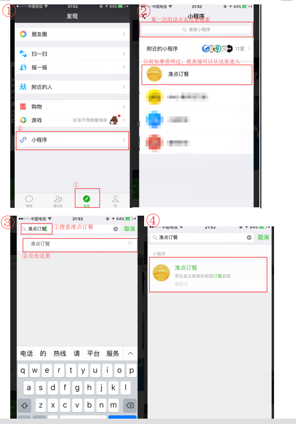

# 微信小程序-点餐不排队。
### 1.注意：不是外卖，因为现在做的是学校的所有食堂，学校所有食堂不让外卖，所以希望通过这个，可以让你们上课就点餐，下课就可以直接去拿，避免浪费不必要的排队时间。 下面是二维码，（建议：手机的话截屏，微信识别二维码），二维码下面有一些小小的期望和提示！

### 2.希望学弟学妹们，积极向我反馈用户体验（简单来说，就是多找找问题=.=，我知道目前界面是很丑，这个问题，我已经找好学长了，只是一时要改，不太方便，以后会改；），先帮忙提一提，一些需要的功能，比如说希望啥啥啥（可以方便你的都行）。
我的
- QQ：553768563
- 微信：jiang_haife_ng 或者 13342266862
- 手机：13342266862
- 邮箱：hackfunjiang@163.com
欢迎来提意见，3Q
### 3.教程：如何找到微信小程序？下面还有第一次扫完码之后，第二次怎么找到微信小程序（跟公众号不一样的哦）。

### 4.下面是海报

